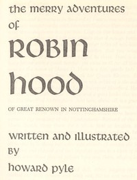

# The Merry Adventures of Robin Hood <kbd>10148</kbd>

## Authors

 - Pyle, Howard <small>(1853 - 1911)</small>

## Subjects

 - Folklore -- England
 - Robin Hood (Legendary character) -- Legends

## Download

 - https://www.gutenberg.org/files/10148/10148.zip
 - https://www.gutenberg.org/files/10148/10148-h/10148-h.htm
 - https://www.gutenberg.org/cache/epub/10148/pg10148.cover.medium.jpg
 - https://www.gutenberg.org/ebooks/10148.html.images
 - https://www.gutenberg.org/files/10148/10148.txt
 - https://www.gutenberg.org/ebooks/10148.txt.utf-8
 - https://www.gutenberg.org/ebooks/10148.epub.images
 - https://www.gutenberg.org/ebooks/10148.rdf
 - https://www.gutenberg.org/ebooks/10148.kindle.images

## Book Shelves

 - Fantasy
