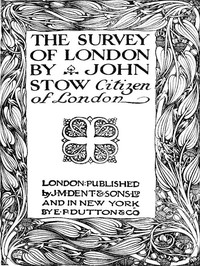

# The Survey of London <kbd>42959</kbd>

## Authors

 - Stow, John <small>(null - 1605)</small>

## Subjects

 - London (England) -- Description and travel
 - London (England) -- History -- 16th century -- Sources
 - London (England) -- Surveys

## Download

 - https://www.gutenberg.org/files/42959/42959.zip
 - https://www.gutenberg.org/cache/epub/42959/pg42959.cover.small.jpg
 - https://www.gutenberg.org/files/42959/42959.txt
 - https://www.gutenberg.org/files/42959/42959-8.txt
 - https://www.gutenberg.org/files/42959/42959-0.txt
 - https://www.gutenberg.org/files/42959/42959-h/42959-h.htm
 - https://www.gutenberg.org/ebooks/42959.html.images
 - https://www.gutenberg.org/ebooks/42959.kindle.images
 - https://www.gutenberg.org/ebooks/42959.rdf
 - https://www.gutenberg.org/ebooks/42959.epub.images

## Book Shelves

