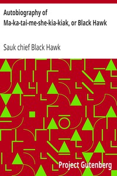

# Autobiography of Ma-ka-tai-me-she-kia-kiak, or Black Hawk <kbd>7097</kbd>

## Authors

 - Black Hawk, Sauk chief <small>(1767 - 1838)</small>

## Subjects

 - Black Hawk War, 1832
 - Black Hawk, Sauk chief, 1767-1838
 - Sauk Indians -- Biography

## Download

 - https://www.gutenberg.org/files/7097/7097.zip
 - https://www.gutenberg.org/files/7097/7097-h/7097-h.htm
 - https://www.gutenberg.org/cache/epub/7097/pg7097.cover.medium.jpg
 - https://www.gutenberg.org/ebooks/7097.html.images
 - https://www.gutenberg.org/files/7097/7097.txt
 - https://www.gutenberg.org/ebooks/7097.kindle.images
 - https://www.gutenberg.org/ebooks/7097.rdf
 - https://www.gutenberg.org/ebooks/7097.epub.images
 - https://www.gutenberg.org/ebooks/7097.txt.utf-8

## Book Shelves

 - Native America
