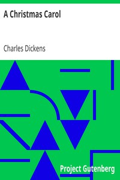

# A Christmas Carol <kbd>24022</kbd>

## Authors

 - Dickens, Charles <small>(1812 - 1870)</small>

## Subjects

 - Christmas stories
 - Ghost stories
 - London (England) -- Fiction
 - Misers -- Fiction
 - Poor families -- Fiction
 - Scrooge, Ebenezer (Fictitious character) -- Fiction
 - Sick children -- Fiction

## Download

 - https://www.gutenberg.org/files/24022/24022-h.zip
 - https://www.gutenberg.org/files/24022/24022.zip
 - https://www.gutenberg.org/files/24022/24022-0.zip
 - https://www.gutenberg.org/files/24022/24022-8.zip
 - https://www.gutenberg.org/ebooks/24022.html.images
 - https://www.gutenberg.org/cache/epub/24022/pg24022.cover.medium.jpg
 - https://www.gutenberg.org/files/24022/24022.txt
 - https://www.gutenberg.org/ebooks/24022.epub.images
 - https://www.gutenberg.org/ebooks/24022.rdf
 - https://www.gutenberg.org/ebooks/24022.kindle.images

## Book Shelves

 - Children's Literature
 - Christmas
