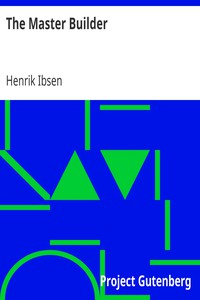

# The Master Builder <kbd>4070</kbd>

## Authors

 - Ibsen, Henrik <small>(1828 - 1906)</small>

## Subjects

 - Architects -- Drama
 - Norwegian drama -- Translations into English

## Download

 - https://www.gutenberg.org/files/4070/4070-h.zip
 - https://www.gutenberg.org/files/4070/4070-h/4070-h.htm
 - https://www.gutenberg.org/cache/epub/4070/pg4070.cover.small.jpg
 - https://www.gutenberg.org/files/4070/4070.txt
 - https://www.gutenberg.org/ebooks/4070.html.images
 - https://www.gutenberg.org/ebooks/4070.txt.utf-8
 - https://www.gutenberg.org/ebooks/4070.kindle.images
 - https://www.gutenberg.org/ebooks/4070.epub.images
 - https://www.gutenberg.org/ebooks/4070.rdf

## Book Shelves

