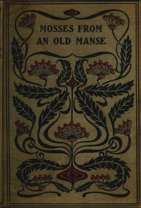

# Mosses from an Old Manse, and Other Stories <kbd>512</kbd>

## Authors

 - Hawthorne, Nathaniel <small>(1804 - 1864)</small>

## Subjects

 - New England -- Social life and customs -- Fiction
 - Short stories

## Download

 - https://www.gutenberg.org/files/512/512.txt
 - https://www.gutenberg.org/files/512/512-h.zip
 - https://www.gutenberg.org/cache/epub/512/pg512.cover.medium.jpg
 - https://www.gutenberg.org/files/512/512-h/512-h.htm
 - https://www.gutenberg.org/ebooks/512.kindle.images
 - https://www.gutenberg.org/ebooks/512.txt.utf-8
 - https://www.gutenberg.org/ebooks/512.rdf
 - https://www.gutenberg.org/ebooks/512.epub.images

## Book Shelves

 - Gothic Fiction
