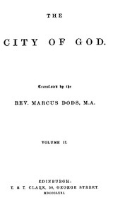

# The City of God, Volume II <kbd>45305</kbd>

## Authors

 - Augustine, Saint, Bishop of Hippo <small>(354 - 430)</small>

## Subjects

 - Apologetics -- Early works to 1800
 - Kingdom of God -- Early works to 1800

## Download

 - https://www.gutenberg.org/files/45305/45305-0.txt
 - https://www.gutenberg.org/files/45305/45305-0.zip
 - https://www.gutenberg.org/cache/epub/45305/pg45305.cover.medium.jpg
 - https://www.gutenberg.org/files/45305/45305-h/45305-h.htm
 - https://www.gutenberg.org/files/45305/45305.txt
 - https://www.gutenberg.org/files/45305/45305-8.txt
 - https://www.gutenberg.org/ebooks/45305.html.images
 - https://www.gutenberg.org/ebooks/45305.kindle.images
 - https://www.gutenberg.org/ebooks/45305.rdf
 - https://www.gutenberg.org/ebooks/45305.epub.images

## Book Shelves

