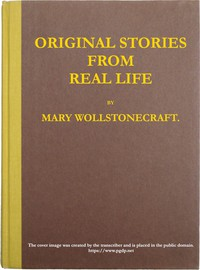

# Original stories from real life: With conversations, calculated to regulate the affections, and form the mind to truth and goodness. <kbd>64275</kbd>

## Authors

 - Wollstonecraft, Mary <small>(1759 - 1797)</small>

## Subjects

 - Children's stories, English
 - Didactic fiction, English

## Download

 - https://www.gutenberg.org/files/64275/64275-h.zip
 - https://www.gutenberg.org/files/64275/64275-h/64275-h.htm
 - https://www.gutenberg.org/cache/epub/64275/pg64275.cover.small.jpg
 - https://www.gutenberg.org/ebooks/64275.html.images
 - https://www.gutenberg.org/files/64275/64275-0.txt
 - https://www.gutenberg.org/ebooks/64275.epub.images
 - https://www.gutenberg.org/ebooks/64275.rdf
 - https://www.gutenberg.org/ebooks/64275.kindle.images

## Book Shelves

