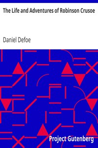

# The Life and Adventures of Robinson Crusoe <kbd>521</kbd>

## Authors

 - Defoe, Daniel <small>(null - 1731)</small>

## Subjects

 - Adventure stories
 - Atlantic Ocean -- Fiction
 - Castaways -- Fiction
 - Crusoe, Robinson (Fictitious character) -- Fiction
 - Islands -- Fiction
 - Shipwreck survival -- Fiction

## Download

 - https://www.gutenberg.org/files/521/521-h/521-h.htm
 - https://www.gutenberg.org/files/521/521-0.zip
 - https://www.gutenberg.org/files/521/521-0.txt
 - https://www.gutenberg.org/cache/epub/521/pg521.cover.small.jpg
 - https://www.gutenberg.org/ebooks/521.html.images
 - https://www.gutenberg.org/ebooks/521.kindle.images
 - https://www.gutenberg.org/ebooks/521.rdf
 - https://www.gutenberg.org/ebooks/521.epub.images

## Book Shelves

