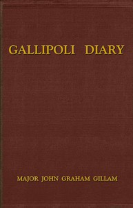

# Gallipoli Diary <kbd>67661</kbd>

## Authors

 - Gillam, John Graham <small>(1884 - 1965)</small>

## Subjects

 - World War, 1914-1918 -- Campaigns -- Turkey -- Gallipoli Peninsula

## Download

 - https://www.gutenberg.org/ebooks/67661.kindle.images
 - https://www.gutenberg.org/files/67661/67661-h.zip
 - https://www.gutenberg.org/ebooks/67661.epub.images
 - https://www.gutenberg.org/cache/epub/67661/pg67661.cover.small.jpg
 - https://www.gutenberg.org/ebooks/67661.txt.utf-8
 - https://www.gutenberg.org/ebooks/67661.rdf
 - https://www.gutenberg.org/files/67661/67661-h/67661-h.htm
 - https://www.gutenberg.org/files/67661/67661-0.txt

## Book Shelves

