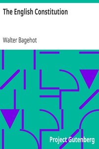

# The English Constitution <kbd>4351</kbd>

## Authors

 - Bagehot, Walter <small>(1826 - 1877)</small>

## Subjects

 - Constitutional history -- Great Britain
 - Constitutional law -- Great Britain
 - Great Britain -- Politics and government

## Download

 - https://www.gutenberg.org/files/4351/4351-8.zip
 - https://www.gutenberg.org/cache/epub/4351/pg4351.cover.small.jpg
 - https://www.gutenberg.org/files/4351/4351-h.zip
 - https://www.gutenberg.org/files/4351/4351.zip
 - https://www.gutenberg.org/ebooks/4351.html.images
 - https://www.gutenberg.org/files/4351/4351.txt
 - https://www.gutenberg.org/ebooks/4351.txt.utf-8
 - https://www.gutenberg.org/ebooks/4351.kindle.images
 - https://www.gutenberg.org/ebooks/4351.rdf
 - https://www.gutenberg.org/ebooks/4351.epub.images

## Book Shelves

 - British Law
