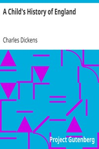

# A Child's History of England <kbd>699</kbd>

## Authors

 - Dickens, Charles <small>(1812 - 1870)</small>

## Subjects

 - Great Britain -- History -- Juvenile literature

## Download

 - https://www.gutenberg.org/files/699/699-h.zip
 - https://www.gutenberg.org/files/699/699-h/699-h.htm
 - https://www.gutenberg.org/files/699/699-0.zip
 - https://www.gutenberg.org/ebooks/699.txt.utf-8
 - https://www.gutenberg.org/files/699/699-0.txt
 - https://www.gutenberg.org/cache/epub/699/pg699.cover.small.jpg
 - https://www.gutenberg.org/ebooks/699.kindle.images
 - https://www.gutenberg.org/ebooks/699.rdf
 - https://www.gutenberg.org/ebooks/699.epub.images

## Book Shelves

 - Children's History
 - United Kingdom
