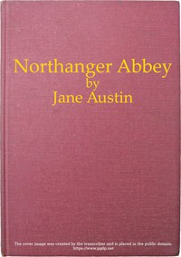

# Northanger Abbey <kbd>121</kbd>

## Authors

 - Austen, Jane <small>(1775 - 1817)</small>

## Subjects

 - Books and reading -- Fiction
 - England -- Fiction
 - England -- Social life and customs -- 19th century -- Fiction
 - Gentry -- England -- Fiction
 - Gothic fiction
 - Horror tales -- Appreciation -- Fiction
 - Love stories
 - Marriage -- Economic aspects -- Fiction
 - Satire
 - Young women -- Fiction

## Download

 - https://www.gutenberg.org/files/121/121-h/121-h.htm.bk1
 - https://www.gutenberg.org/cache/epub/121/pg121.cover.small.jpg
 - https://www.gutenberg.org/files/121/121-0.zip
 - https://www.gutenberg.org/ebooks/121.txt.utf-8
 - https://www.gutenberg.org/files/121/121-h/121-h.htm
 - https://www.gutenberg.org/files/121/121-0.txt
 - https://www.gutenberg.org/ebooks/121.kindle.images
 - https://www.gutenberg.org/ebooks/121.rdf
 - https://www.gutenberg.org/ebooks/121.epub.images

## Book Shelves

 - Gothic Fiction
