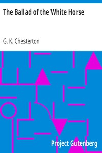

# The Ballad of the White Horse <kbd>1719</kbd>

## Authors

 - Chesterton, G. K. (Gilbert Keith) <small>(1874 - 1936)</small>

## Subjects

 - Alfred, King of England, 849-899 -- Poetry
 - Christian poetry
 - Epic poetry
 - Great Britain -- History -- Alfred, 871-899 -- Poetry
 - Historical poetry
 - White Horse, Vale of (England) -- Poetry

## Download

 - https://www.gutenberg.org/files/1719/1719-h/1719-h.htm
 - https://www.gutenberg.org/cache/epub/1719/pg1719.cover.medium.jpg
 - https://www.gutenberg.org/files/1719/1719-h.zip
 - https://www.gutenberg.org/files/1719/1719.txt
 - https://www.gutenberg.org/ebooks/1719.html.images
 - https://www.gutenberg.org/ebooks/1719.rdf
 - https://www.gutenberg.org/ebooks/1719.epub.images
 - https://www.gutenberg.org/ebooks/1719.kindle.images
 - https://www.gutenberg.org/ebooks/1719.txt.utf-8

## Book Shelves

