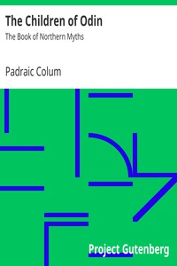

# The Children of Odin: The Book of Northern Myths <kbd>24737</kbd>

## Authors

 - Colum, Padraic <small>(1881 - 1972)</small>

## Subjects

 - Mythology, Norse -- Juvenile literature

## Download

 - https://www.gutenberg.org/files/24737/24737-h.zip
 - https://www.gutenberg.org/files/24737/24737-8.zip
 - https://www.gutenberg.org/files/24737/24737.txt
 - https://www.gutenberg.org/files/24737/24737-8.txt
 - https://www.gutenberg.org/ebooks/24737.html.images
 - https://www.gutenberg.org/cache/epub/24737/pg24737.cover.medium.jpg
 - https://www.gutenberg.org/ebooks/24737.kindle.images
 - https://www.gutenberg.org/ebooks/24737.txt.utf-8
 - https://www.gutenberg.org/ebooks/24737.epub.images
 - https://www.gutenberg.org/ebooks/24737.rdf

## Book Shelves

 - Children's Myths, Fairy Tales, etc.
 - Paganism
