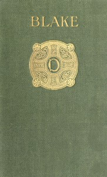

# William Blake <kbd>67639</kbd>

## Authors

 - Chesterton, G. K. (Gilbert Keith) <small>(1874 - 1936)</small>

## Subjects

 - Artists -- England -- Biography
 - Blake, William, 1757-1827
 - Poets, English -- 18th century -- Biography
 - Poets, English -- 19th century -- Biography

## Download

 - https://www.gutenberg.org/ebooks/67639.epub.images
 - https://www.gutenberg.org/ebooks/67639.txt.utf-8
 - https://www.gutenberg.org/ebooks/67639.html.images
 - https://www.gutenberg.org/ebooks/67639.kindle.images
 - https://www.gutenberg.org/cache/epub/67639/pg67639.cover.small.jpg
 - https://www.gutenberg.org/ebooks/67639.rdf
 - https://www.gutenberg.org/files/67639/67639-0.zip
 - https://www.gutenberg.org/files/67639/67639-0.txt
 - https://www.gutenberg.org/files/67639/67639-h.zip

## Book Shelves

