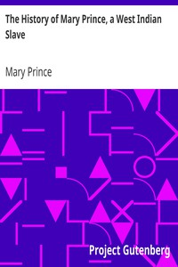

# The History of Mary Prince, a West Indian Slave <kbd>17851</kbd>

## Authors

 - Prince, Mary <small>(1788 - 1833)</small>

## Subjects

 - Fugitive slaves -- West Indies -- Biography
 - Prince, Mary
 - Slavery -- West Indies

## Download

 - https://www.gutenberg.org/files/17851/17851.zip
 - https://www.gutenberg.org/files/17851/17851-h.zip
 - https://www.gutenberg.org/cache/epub/17851/pg17851.cover.small.jpg
 - https://www.gutenberg.org/files/17851/17851-h/17851-h.htm
 - https://www.gutenberg.org/files/17851/17851-8.txt
 - https://www.gutenberg.org/ebooks/17851.html.images
 - https://www.gutenberg.org/ebooks/17851.txt.utf-8
 - https://www.gutenberg.org/ebooks/17851.epub.images
 - https://www.gutenberg.org/ebooks/17851.rdf
 - https://www.gutenberg.org/ebooks/17851.kindle.images

## Book Shelves

 - Historical Fiction
