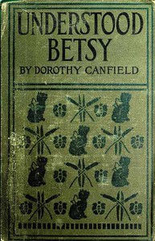

# Understood Betsy <kbd>5347</kbd>

## Authors

 - Fisher, Dorothy Canfield <small>(1879 - 1958)</small>

## Subjects

 - Country life -- Juvenile fiction
 - Orphans -- Juvenile fiction
 - Self-perception -- Juvenile fiction
 - Vermont -- Juvenile fiction

## Download

 - https://www.gutenberg.org/cache/epub/5347/pg5347.cover.small.jpg
 - https://www.gutenberg.org/files/5347/5347-0.zip
 - https://www.gutenberg.org/ebooks/5347.html.images
 - https://www.gutenberg.org/files/5347/5347-0.txt
 - https://www.gutenberg.org/ebooks/5347.txt.utf-8
 - https://www.gutenberg.org/ebooks/5347.kindle.images
 - https://www.gutenberg.org/ebooks/5347.epub.images
 - https://www.gutenberg.org/ebooks/5347.rdf

## Book Shelves

 - Children's Literature
