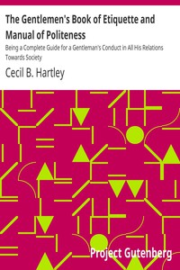

# The Gentlemen's Book of Etiquette and Manual of Politeness: Being a Complete Guide for a Gentleman's Conduct in All His Relations Towards Society <kbd>39293</kbd>

## Authors

 - Hartley, Cecil B. <small>(null - null)</small>

## Subjects

 - Etiquette
 - Etiquette for men
 - Men -- Conduct of life

## Download

 - https://www.gutenberg.org/files/39293/39293-8.zip
 - https://www.gutenberg.org/files/39293/39293-h.zip
 - https://www.gutenberg.org/files/39293/39293-0.zip
 - https://www.gutenberg.org/files/39293/39293-0.txt
 - https://www.gutenberg.org/cache/epub/39293/pg39293.cover.medium.jpg
 - https://www.gutenberg.org/files/39293/39293.txt
 - https://www.gutenberg.org/ebooks/39293.html.images
 - https://www.gutenberg.org/ebooks/39293.epub.images
 - https://www.gutenberg.org/ebooks/39293.rdf
 - https://www.gutenberg.org/ebooks/39293.kindle.images

## Book Shelves

