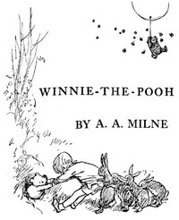

# Winnie-the-Pooh <kbd>67098</kbd>

## Authors

 - Milne, A. A. (Alan Alexander) <small>(1882 - 1956)</small>

## Subjects

 - Christopher Robin (Fictitious character) -- Juvenile fiction
 - Eeyore (Fictitious character) -- Juvenile fiction
 - Piglet (Fictitious character) -- Juvenile fiction
 - Teddy bears -- Juvenile fiction
 - Toys -- Juvenile fiction
 - Winnie-the-Pooh (Fictitious character) -- Juvenile fiction

## Download

 - https://www.gutenberg.org/files/67098/67098-h.zip
 - https://www.gutenberg.org/files/67098/67098-0.zip
 - https://www.gutenberg.org/cache/epub/67098/pg67098.cover.medium.jpg
 - https://www.gutenberg.org/ebooks/67098.rdf
 - https://www.gutenberg.org/ebooks/67098.epub.images
 - https://www.gutenberg.org/ebooks/67098.txt.utf-8
 - https://www.gutenberg.org/ebooks/67098.kindle.images
 - https://www.gutenberg.org/files/67098/67098-h/67098-h.htm
 - https://www.gutenberg.org/files/67098/67098-0.txt

## Book Shelves

