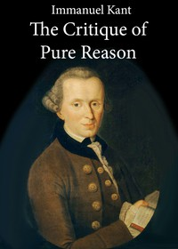

# The Critique of Pure Reason <kbd>4280</kbd>

## Authors

 - Kant, Immanuel <small>(1724 - 1804)</small>

## Subjects

 - Causation
 - Knowledge, Theory of
 - Philosophy, German
 - Reason

## Download

 - https://www.gutenberg.org/cache/epub/4280/pg4280.cover.small.jpg
 - https://www.gutenberg.org/files/4280/4280-0.txt
 - https://www.gutenberg.org/files/4280/4280-h.zip
 - https://www.gutenberg.org/files/4280/4280-h/4280-h.htm
 - https://www.gutenberg.org/ebooks/4280.html.images
 - https://www.gutenberg.org/ebooks/4280.kindle.images
 - https://www.gutenberg.org/ebooks/4280.rdf
 - https://www.gutenberg.org/ebooks/4280.epub.images

## Book Shelves

 - Philosophy
