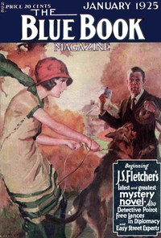

# The Missing Will <kbd>67173</kbd>

## Authors

 - Christie, Agatha <small>(1890 - 1976)</small>

## Subjects

 - Detective and mystery stories
 - Inheritance and succession -- Fiction
 - Poirot, Hercule (Fictitious character) -- Fiction
 - Private investigators -- England -- Fiction
 - Short stories
 - Wills -- Fiction

## Download

 - https://www.gutenberg.org/ebooks/67173.html.images
 - https://www.gutenberg.org/files/67173/67173-h.zip
 - https://www.gutenberg.org/cache/epub/67173/pg67173.cover.medium.jpg
 - https://www.gutenberg.org/ebooks/67173.txt.utf-8
 - https://www.gutenberg.org/ebooks/67173.epub.images
 - https://www.gutenberg.org/ebooks/67173.rdf
 - https://www.gutenberg.org/ebooks/67173.kindle.images
 - https://www.gutenberg.org/files/67173/67173-0.txt

## Book Shelves

