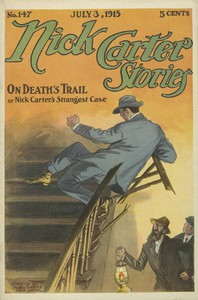

# Nick Carter Stories No. 147, July 3, 1915 <kbd>67617</kbd>

## Authors

 - Carter, Nicholas (House name) <small>(null - null)</small>
 - Boston, Ralph <small>(null - null)</small>

## Subjects

 - Detective and mystery stories, American -- Periodicals
 - Popular literature -- Periodicals

## Download

 - https://www.gutenberg.org/ebooks/67617.txt.utf-8
 - https://www.gutenberg.org/ebooks/67617.kindle.images
 - https://www.gutenberg.org/files/67617/67617-0.zip
 - https://www.gutenberg.org/ebooks/67617.rdf
 - https://www.gutenberg.org/cache/epub/67617/pg67617.cover.small.jpg
 - https://www.gutenberg.org/ebooks/67617.epub.images
 - https://www.gutenberg.org/files/67617/67617-0.txt
 - https://www.gutenberg.org/files/67617/67617-h/67617-h.htm
 - https://www.gutenberg.org/files/67617/67617-h.zip

## Book Shelves

