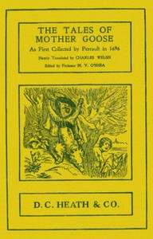

# The Tales of Mother Goose: As First Collected by Charles Perrault in 1696 <kbd>17208</kbd>

## Authors

 - Perrault, Charles <small>(1628 - 1703)</small>

## Subjects

 - Children's stories, French -- Translations into English
 - Fairy tales
 - Fairy tales -- France

## Download

 - https://www.gutenberg.org/files/17208/17208-8.txt
 - https://www.gutenberg.org/files/17208/17208-h.zip
 - https://www.gutenberg.org/files/17208/17208.zip
 - https://www.gutenberg.org/cache/epub/17208/pg17208.cover.small.jpg
 - https://www.gutenberg.org/ebooks/17208.html.images
 - https://www.gutenberg.org/files/17208/17208.txt
 - https://www.gutenberg.org/ebooks/17208.txt.utf-8
 - https://www.gutenberg.org/ebooks/17208.kindle.images
 - https://www.gutenberg.org/ebooks/17208.epub.images
 - https://www.gutenberg.org/ebooks/17208.rdf

## Book Shelves

 - Children's Picture Books
