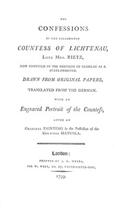

# The Confessions of the Celebrated Countess of Lichtenau, Late Mrs. Rietz: Now Confined in the Fortress of Gloglau as a State-prisoner <kbd>67532</kbd>

## Authors

 - Husen, Heinrich <small>(null - null)</small>

## Subjects

 - Lichtenau, Wilhelmine Enke, Gräfin Lichtenau, 1752-1820
 - Prussia (Germany) -- History -- Frederick William II, 1786-1797 -- Biography

## Download

 - https://www.gutenberg.org/ebooks/67532.rdf
 - https://www.gutenberg.org/cache/epub/67532/pg67532.cover.medium.jpg
 - https://www.gutenberg.org/files/67532/67532-0.zip
 - https://www.gutenberg.org/ebooks/67532.epub.images
 - https://www.gutenberg.org/ebooks/67532.kindle.images
 - https://www.gutenberg.org/ebooks/67532.txt.utf-8
 - https://www.gutenberg.org/files/67532/67532-0.txt
 - https://www.gutenberg.org/files/67532/67532-h/67532-h.htm

## Book Shelves

