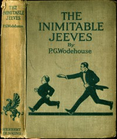

# The Inimitable Jeeves <kbd>59254</kbd>

## Authors

 - Wodehouse, P. G. (Pelham Grenville) <small>(1881 - 1975)</small>

## Subjects

 - England -- Social life and customs -- Fiction
 - Humorous stories
 - Jeeves (Fictitious character) -- Fiction
 - Single men -- Fiction
 - Upper class -- England -- Fiction
 - Valets -- Fiction
 - Wooster, Bertie (Fictitious character) -- Fiction

## Download

 - https://www.gutenberg.org/ebooks/59254.html.images
 - https://www.gutenberg.org/files/59254/59254-0.txt
 - https://www.gutenberg.org/files/59254/59254-h.zip
 - https://www.gutenberg.org/cache/epub/59254/pg59254.cover.small.jpg
 - https://www.gutenberg.org/ebooks/59254.rdf
 - https://www.gutenberg.org/ebooks/59254.epub.images
 - https://www.gutenberg.org/ebooks/59254.kindle.images

## Book Shelves

