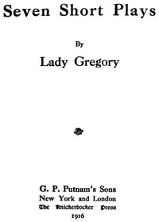

# Seven Short Plays <kbd>41653</kbd>

## Authors

 - Gregory, Lady <small>(1852 - 1932)</small>

## Subjects

 - Ireland -- Drama

## Download

 - https://www.gutenberg.org/files/41653/41653-h.zip
 - https://www.gutenberg.org/files/41653/41653.zip
 - https://www.gutenberg.org/files/41653/41653-0.zip
 - https://www.gutenberg.org/cache/epub/41653/pg41653.cover.small.jpg
 - https://www.gutenberg.org/files/41653/41653.txt
 - https://www.gutenberg.org/files/41653/41653-8.txt
 - https://www.gutenberg.org/ebooks/41653.html.images
 - https://www.gutenberg.org/ebooks/41653.rdf
 - https://www.gutenberg.org/ebooks/41653.kindle.images
 - https://www.gutenberg.org/ebooks/41653.epub.images

## Book Shelves

