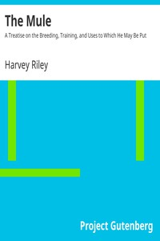

# The Mule: A Treatise on the Breeding, Training, and Uses to Which He May Be Put <kbd>10878</kbd>

## Authors

 - Riley, Harvey <small>(null - null)</small>

## Subjects

 - Mules

## Download

 - https://www.gutenberg.org/files/10878/10878-8.zip
 - https://www.gutenberg.org/files/10878/10878-h/10878-h.htm
 - https://www.gutenberg.org/cache/epub/10878/pg10878.cover.small.jpg
 - https://www.gutenberg.org/files/10878/10878.txt
 - https://www.gutenberg.org/ebooks/10878.html.images
 - https://www.gutenberg.org/ebooks/10878.txt.utf-8
 - https://www.gutenberg.org/ebooks/10878.kindle.images
 - https://www.gutenberg.org/ebooks/10878.epub.images
 - https://www.gutenberg.org/ebooks/10878.rdf

## Book Shelves

