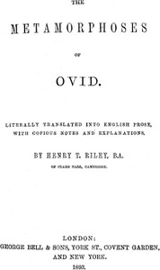

# The Metamorphoses of Ovid, Books I-VII <kbd>21765</kbd>

## Authors

 - Ovid <small>(-43 - 17)</small>

## Subjects

 - Classical literature
 - Fables, Latin -- Translations into English
 - Latin poetry -- Translations into English
 - Metamorphosis -- Mythology -- Poetry
 - Mythology, Classical -- Poetry

## Download

 - https://www.gutenberg.org/files/21765/21765-h.zip
 - https://www.gutenberg.org/files/21765/21765-0.zip
 - https://www.gutenberg.org/cache/epub/21765/pg21765.cover.medium.jpg
 - https://www.gutenberg.org/ebooks/21765.html.images
 - https://www.gutenberg.org/ebooks/21765.epub.images
 - https://www.gutenberg.org/ebooks/21765.kindle.images
 - https://www.gutenberg.org/ebooks/21765.rdf

## Book Shelves

 - Best Books Ever Listings
