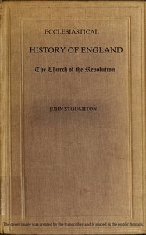

# Ecclesiastical History of England: The Church of the Revolution <kbd>67727</kbd>

## Authors

 - Stoughton, John <small>(1807 - 1897)</small>

## Subjects

## Download

 - https://www.gutenberg.org/ebooks/67727.kindle.images
 - https://www.gutenberg.org/files/67727/67727-h.zip
 - https://www.gutenberg.org/ebooks/67727.epub.images
 - https://www.gutenberg.org/ebooks/67727.txt.utf-8
 - https://www.gutenberg.org/files/67727/67727-0.zip
 - https://www.gutenberg.org/ebooks/67727.rdf
 - https://www.gutenberg.org/cache/epub/67727/pg67727.cover.medium.jpg
 - https://www.gutenberg.org/files/67727/67727-0.txt
 - https://www.gutenberg.org/files/67727/67727-h/67727-h.htm

## Book Shelves

