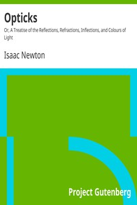

# Opticks: Or, A Treatise of the Reflections, Refractions, Inflections, and Colours of Light <kbd>33504</kbd>

## Authors

 - Newton, Isaac <small>(1642 - 1727)</small>

## Subjects

 - Optics -- Early works to 1800

## Download

 - https://www.gutenberg.org/files/33504/33504.txt
 - https://www.gutenberg.org/files/33504/33504-h/33504-h.htm
 - https://www.gutenberg.org/cache/epub/33504/pg33504.cover.small.jpg
 - https://www.gutenberg.org/files/33504/33504-8.zip
 - https://www.gutenberg.org/ebooks/33504.html.images
 - https://www.gutenberg.org/files/33504/33504-8.txt
 - https://www.gutenberg.org/ebooks/33504.txt.utf-8
 - https://www.gutenberg.org/ebooks/33504.rdf
 - https://www.gutenberg.org/ebooks/33504.kindle.images
 - https://www.gutenberg.org/ebooks/33504.epub.images

## Book Shelves

 - Physics
