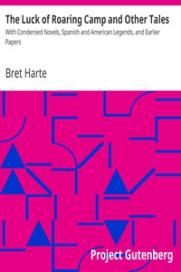

# The Luck of Roaring Camp and Other Tales: With Condensed Novels, Spanish and American Legends, and Earlier Papers <kbd>6373</kbd>

## Authors

 - Harte, Bret <small>(1836 - 1902)</small>

## Subjects

 - Frontier and pioneer life -- West (U.S.) -- Fiction
 - Western stories

## Download

 - https://www.gutenberg.org/files/6373/6373-h/6373-h.htm
 - https://www.gutenberg.org/files/6373/6373.zip
 - https://www.gutenberg.org/cache/epub/6373/pg6373.cover.small.jpg
 - https://www.gutenberg.org/files/6373/6373-0.txt
 - https://www.gutenberg.org/ebooks/6373.html.images
 - https://www.gutenberg.org/ebooks/6373.kindle.images
 - https://www.gutenberg.org/ebooks/6373.rdf
 - https://www.gutenberg.org/ebooks/6373.epub.images

## Book Shelves

