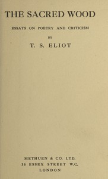

# The Sacred Wood: Essays on Poetry and Criticism <kbd>57795</kbd>

## Authors

 - Eliot, T. S. (Thomas Stearns) <small>(1888 - 1965)</small>

## Subjects

 - Criticism
 - Literature

## Download

 - https://www.gutenberg.org/files/57795/57795-h.zip
 - https://www.gutenberg.org/files/57795/57795-h/57795-h.htm
 - https://www.gutenberg.org/cache/epub/57795/pg57795.cover.medium.jpg
 - https://www.gutenberg.org/files/57795/57795-0.zip
 - https://www.gutenberg.org/ebooks/57795.html.images
 - https://www.gutenberg.org/ebooks/57795.epub.images
 - https://www.gutenberg.org/ebooks/57795.rdf
 - https://www.gutenberg.org/ebooks/57795.kindle.images

## Book Shelves

