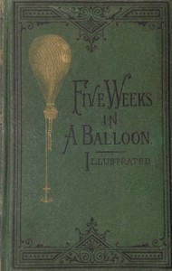

# Five Weeks in a Balloon: Or, Journeys and Discoveries in Africa by Three Englishmen <kbd>3526</kbd>

## Authors

 - Verne, Jules <small>(1828 - 1905)</small>

## Subjects

 - Adventure stories
 - Africa -- Fiction
 - Balloons -- Fiction
 - Science fiction
 - Travel -- Fiction

## Download

 - https://www.gutenberg.org/files/3526/3526-h.zip
 - https://www.gutenberg.org/files/3526/3526-h/3526-h.htm
 - https://www.gutenberg.org/cache/epub/3526/pg3526.cover.medium.jpg
 - https://www.gutenberg.org/files/3526/3526-0.txt
 - https://www.gutenberg.org/ebooks/3526.html.images
 - https://www.gutenberg.org/ebooks/3526.rdf
 - https://www.gutenberg.org/ebooks/3526.kindle.images
 - https://www.gutenberg.org/ebooks/3526.epub.images

## Book Shelves

 - Adventure
 - Movie Books
