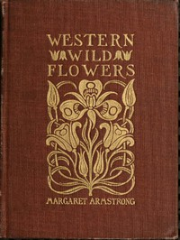

# Field Book of Western Wild Flowers <kbd>47971</kbd>

## Authors

 - Thornber, J. J. (John James) <small>(1872 - 1962)</small>
 - Armstrong, Margaret <small>(1867 - 1944)</small>

## Subjects

 - Flowers -- West (U.S.)
 - Flowers -- West (U.S.) -- Pictorial works

## Download

 - https://www.gutenberg.org/files/47971/47971-8.txt
 - https://www.gutenberg.org/files/47971/47971-h.zip
 - https://www.gutenberg.org/cache/epub/47971/pg47971.cover.small.jpg
 - https://www.gutenberg.org/files/47971/47971-h/47971-h.htm
 - https://www.gutenberg.org/ebooks/47971.html.images
 - https://www.gutenberg.org/ebooks/47971.epub.images
 - https://www.gutenberg.org/ebooks/47971.rdf
 - https://www.gutenberg.org/ebooks/47971.txt.utf-8
 - https://www.gutenberg.org/ebooks/47971.kindle.images

## Book Shelves

