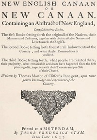

# The New English Canaan of Thomas Morton with Introductory Matter and Notes <kbd>54162</kbd>

## Authors

 - Morton, Thomas <small>(1575 - 1646)</small>

## Subjects

 - Indians of North America -- Massachusetts -- History -- 17th century
 - Indians of North America -- New England -- History -- 17th century
 - Massachusetts -- Description and travel -- Early works to 1800
 - Massachusetts -- History -- Colonial period, ca. 1600-1775
 - Morton, Thomas, 1575-1646 -- Travel -- New England
 - New England -- Description and travel -- Early works to 1800
 - New England -- History -- Colonial period, ca. 1600-1775

## Download

 - https://www.gutenberg.org/files/54162/54162-0.txt
 - https://www.gutenberg.org/files/54162/54162-0.zip
 - https://www.gutenberg.org/cache/epub/54162/pg54162.cover.small.jpg
 - https://www.gutenberg.org/files/54162/54162-h/54162-h.htm
 - https://www.gutenberg.org/ebooks/54162.rdf
 - https://www.gutenberg.org/ebooks/54162.kindle.images
 - https://www.gutenberg.org/ebooks/54162.epub.images

## Book Shelves

