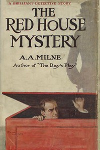

# The Red House Mystery <kbd>1872</kbd>

## Authors

 - Milne, A. A. (Alan Alexander) <small>(1882 - 1956)</small>

## Subjects

 - Detective and mystery stories
 - England -- Fiction

## Download

 - https://www.gutenberg.org/files/1872/1872-h/1872-h.htm
 - https://www.gutenberg.org/files/1872/1872-h.zip
 - https://www.gutenberg.org/cache/epub/1872/pg1872.cover.medium.jpg
 - https://www.gutenberg.org/files/1872/1872-0.zip
 - https://www.gutenberg.org/files/1872/1872.txt
 - https://www.gutenberg.org/ebooks/1872.html.images
 - https://www.gutenberg.org/ebooks/1872.epub.images
 - https://www.gutenberg.org/ebooks/1872.rdf
 - https://www.gutenberg.org/ebooks/1872.kindle.images

## Book Shelves

 - Detective Fiction
