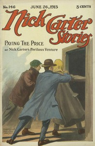

# Nick Carter Stories No. 146, June 26, 1915 <kbd>67618</kbd>

## Authors

 - Carter, Nicholas (House name) <small>(null - null)</small>
 - Waddell, C. C. (Charles Carey) <small>(1868 - 1930)</small>

## Subjects

 - Detective and mystery stories, American -- Periodicals
 - Popular literature -- Periodicals

## Download

 - https://www.gutenberg.org/ebooks/67618.txt.utf-8
 - https://www.gutenberg.org/ebooks/67618.rdf
 - https://www.gutenberg.org/ebooks/67618.html.images
 - https://www.gutenberg.org/ebooks/67618.epub.images
 - https://www.gutenberg.org/cache/epub/67618/pg67618.cover.small.jpg
 - https://www.gutenberg.org/ebooks/67618.kindle.images
 - https://www.gutenberg.org/files/67618/67618-0.txt
 - https://www.gutenberg.org/files/67618/67618-h.zip
 - https://www.gutenberg.org/files/67618/67618-0.zip

## Book Shelves

