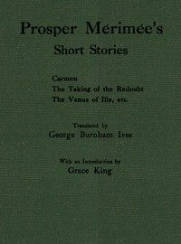

# Prosper Mérimée's Short Stories <kbd>67643</kbd>

## Authors

 - Mérimée, Prosper <small>(1803 - 1870)</small>

## Subjects

 - French fiction -- Translations into English
 - Short stories, French -- Translations into English

## Download

 - https://www.gutenberg.org/ebooks/67643.kindle.images
 - https://www.gutenberg.org/ebooks/67643.rdf
 - https://www.gutenberg.org/ebooks/67643.txt.utf-8
 - https://www.gutenberg.org/cache/epub/67643/pg67643.cover.small.jpg
 - https://www.gutenberg.org/ebooks/67643.epub.images
 - https://www.gutenberg.org/ebooks/67643.html.images
 - https://www.gutenberg.org/files/67643/67643-0.txt
 - https://www.gutenberg.org/files/67643/67643-h.zip

## Book Shelves

