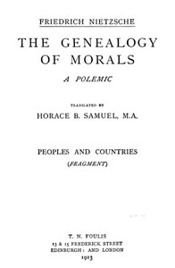

# The Genealogy of Morals: The Complete Works, Volume Thirteen, edited by Dr. Oscar Levy. <kbd>52319</kbd>

## Authors

 - Nietzsche, Friedrich Wilhelm <small>(1844 - 1900)</small>

## Subjects

 - Ethics

## Download

 - https://www.gutenberg.org/files/52319/52319-h/52319-h.htm
 - https://www.gutenberg.org/cache/epub/52319/pg52319.cover.medium.jpg
 - https://www.gutenberg.org/files/52319/52319-0.zip
 - https://www.gutenberg.org/files/52319/52319-h.zip
 - https://www.gutenberg.org/ebooks/52319.html.images
 - https://www.gutenberg.org/ebooks/52319.epub.images
 - https://www.gutenberg.org/ebooks/52319.rdf
 - https://www.gutenberg.org/ebooks/52319.kindle.images

## Book Shelves

