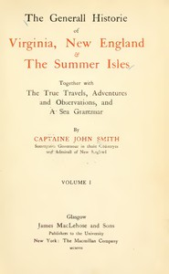

# The General Historie of Virginia, New England & the Summer Isles  (Vol. I): Together with the True Travels, Adventures and Observations, and a Sea Grammar <kbd>56347</kbd>

## Authors

 - Smith, John <small>(1580 - 1631)</small>

## Subjects

 - Bermuda Islands -- History
 - Indians of North America -- Virginia
 - Navigation
 - New England -- History -- Colonial period, ca. 1600-1775
 - Smith, John, 1580-1631
 - Virginia -- History -- Colonial period, ca. 1600-1775

## Download

 - https://www.gutenberg.org/cache/epub/56347/pg56347.cover.small.jpg
 - https://www.gutenberg.org/files/56347/56347-h.zip
 - https://www.gutenberg.org/ebooks/56347.html.images
 - https://www.gutenberg.org/files/56347/56347.txt
 - https://www.gutenberg.org/files/56347/56347-h/56347-h.htm
 - https://www.gutenberg.org/ebooks/56347.txt.utf-8
 - https://www.gutenberg.org/ebooks/56347.rdf
 - https://www.gutenberg.org/ebooks/56347.epub.images
 - https://www.gutenberg.org/ebooks/56347.kindle.images

## Book Shelves

