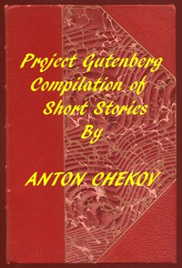

# Project Gutenberg Compilation of Short Stories by Chekhov <kbd>57333</kbd>

## Authors

 - Chekhov, Anton Pavlovich <small>(1860 - 1904)</small>

## Subjects

 - Chekhov, Anton Pavlovich, 1860-1904 -- Translations into English
 - Russia -- Social life and customs -- Fiction
 - Russian fiction -- Translations into English
 - Short stories, Russian -- Translations into English

## Download

 - https://www.gutenberg.org/files/57333/57333-0.zip
 - https://www.gutenberg.org/files/57333/57333-h/57333-h.htm
 - https://www.gutenberg.org/cache/epub/57333/pg57333.cover.medium.jpg
 - https://www.gutenberg.org/ebooks/57333.txt.utf-8
 - https://www.gutenberg.org/files/57333/57333-0.txt
 - https://www.gutenberg.org/ebooks/57333.epub.images
 - https://www.gutenberg.org/ebooks/57333.rdf
 - https://www.gutenberg.org/ebooks/57333.kindle.images

## Book Shelves

