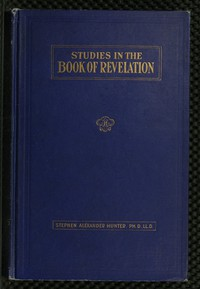

# A Bible School Manual: Studies in the Book of Revelation: An introduction, analysis, and notes, containing a concise interpretation according to the symbolic view, numerous references to authorities, and general mention of other interpretations, with the text of the American revised version edited in paragraphs, for the use of Bible students <kbd>53775</kbd>

## Authors

 - Hunter, Stephen Alexander <small>(1851 - null)</small>

## Subjects

 - Bible. Revelation -- Commentaries

## Download

 - https://www.gutenberg.org/files/53775/53775-pdf.zip
 - https://www.gutenberg.org/files/53775/53775-8.zip
 - https://www.gutenberg.org/files/53775/53775-tei.zip
 - https://www.gutenberg.org/files/53775/53775-0.txt
 - https://www.gutenberg.org/cache/epub/53775/pg53775.cover.medium.jpg
 - https://www.gutenberg.org/files/53775/53775.txt
 - https://www.gutenberg.org/ebooks/53775.html.images
 - https://www.gutenberg.org/ebooks/53775.rdf
 - https://www.gutenberg.org/ebooks/53775.epub.images
 - https://www.gutenberg.org/files/53775/53775-pdf.pdf
 - https://www.gutenberg.org/ebooks/53775.kindle.images
 - https://www.gutenberg.org/files/53775/53775-tei/53775-tei.tei

## Book Shelves

