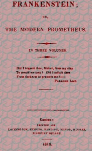

# Frankenstein; Or, The Modern Prometheus <kbd>41445</kbd>

## Authors

 - Shelley, Mary Wollstonecraft <small>(1797 - 1851)</small>

## Subjects

 - Frankenstein's monster (Fictitious character) -- Fiction
 - Frankenstein, Victor (Fictitious character) -- Fiction
 - Gothic fiction
 - Horror tales
 - Monsters -- Fiction
 - Science fiction
 - Scientists -- Fiction

## Download

 - https://www.gutenberg.org/cache/epub/41445/pg41445.cover.medium.jpg
 - https://www.gutenberg.org/files/41445/41445-h.zip
 - https://www.gutenberg.org/ebooks/41445.html.images
 - https://www.gutenberg.org/ebooks/41445.txt.utf-8
 - https://www.gutenberg.org/files/41445/41445-0.txt
 - https://www.gutenberg.org/ebooks/41445.kindle.images
 - https://www.gutenberg.org/ebooks/41445.rdf
 - https://www.gutenberg.org/ebooks/41445.epub.images

## Book Shelves

 - Precursors of Science Fiction
 - Science Fiction by Women
