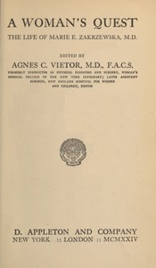

# A Woman's Quest: The life of Marie E. Zakrzewska, M.D. <kbd>67504</kbd>

## Authors

 - Zakrzewska, Marie E. (Marie Elizabeth) <small>(1829 - 1902)</small>

## Subjects

 - Women physicians -- United States -- Biography
 - Zakrzewska, Marie E. (Marie Elizabeth), 1829-1902

## Download

 - https://www.gutenberg.org/ebooks/67504.html.images
 - https://www.gutenberg.org/ebooks/67504.epub.images
 - https://www.gutenberg.org/ebooks/67504.rdf
 - https://www.gutenberg.org/files/67504/67504-h.zip
 - https://www.gutenberg.org/cache/epub/67504/pg67504.cover.medium.jpg
 - https://www.gutenberg.org/ebooks/67504.txt.utf-8
 - https://www.gutenberg.org/files/67504/67504-0.zip
 - https://www.gutenberg.org/ebooks/67504.kindle.images
 - https://www.gutenberg.org/files/67504/67504-0.txt

## Book Shelves

