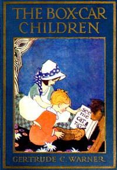

# The Box-Car Children <kbd>42796</kbd>

## Authors

 - Warner, Gertrude Chandler <small>(1890 - 1979)</small>

## Subjects

 - Adventure and adventurers -- Juvenile fiction
 - Boxcar children (Fictitious characters) -- Juvenile fiction
 - Brothers and sisters -- Juvenile fiction
 - Children -- Conduct of life -- Juvenile fiction
 - Conduct of life -- Juvenile fiction
 - Families -- Juvenile fiction
 - Orphans -- Juvenile fiction

## Download

 - https://www.gutenberg.org/files/42796/42796-h.zip
 - https://www.gutenberg.org/cache/epub/42796/pg42796.cover.medium.jpg
 - https://www.gutenberg.org/files/42796/42796-h/42796-h.htm
 - https://www.gutenberg.org/files/42796/42796.txt
 - https://www.gutenberg.org/ebooks/42796.html.images
 - https://www.gutenberg.org/ebooks/42796.kindle.images
 - https://www.gutenberg.org/ebooks/42796.rdf
 - https://www.gutenberg.org/ebooks/42796.txt.utf-8
 - https://www.gutenberg.org/ebooks/42796.epub.images

## Book Shelves

