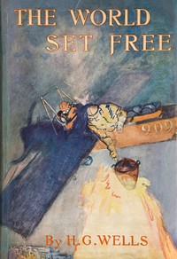

# The World Set Free <kbd>1059</kbd>

## Authors

 - Wells, H. G. (Herbert George) <small>(1866 - 1946)</small>

## Subjects

 - Imaginary wars and battles -- Fiction
 - Nuclear warfare -- Fiction
 - War stories

## Download

 - https://www.gutenberg.org/files/1059/1059-0.zip
 - https://www.gutenberg.org/cache/epub/1059/pg1059.cover.medium.jpg
 - https://www.gutenberg.org/files/1059/1059-h.zip
 - https://www.gutenberg.org/files/1059/1059-0.txt
 - https://www.gutenberg.org/ebooks/1059.html.images
 - https://www.gutenberg.org/ebooks/1059.rdf
 - https://www.gutenberg.org/ebooks/1059.epub.images
 - https://www.gutenberg.org/ebooks/1059.kindle.images

## Book Shelves

 - Science Fiction
