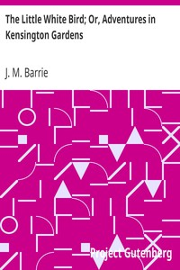

# The Little White Bird; Or, Adventures in Kensington Gardens <kbd>1376</kbd>

## Authors

 - Barrie, J. M. (James Matthew) <small>(1860 - 1937)</small>

## Subjects

 - Adventure stories
 - Fairies -- Fiction
 - Kensington (London, England) -- Fiction
 - Kensington Gardens (London, England) -- Fiction
 - Peter Pan (Fictitious character) -- Fiction

## Download

 - https://www.gutenberg.org/cache/epub/1376/pg1376.cover.small.jpg
 - https://www.gutenberg.org/files/1376/1376-h.zip
 - https://www.gutenberg.org/files/1376/1376-0.zip
 - https://www.gutenberg.org/files/1376/1376.txt
 - https://www.gutenberg.org/files/1376/1376-0.txt
 - https://www.gutenberg.org/ebooks/1376.html.images
 - https://www.gutenberg.org/ebooks/1376.rdf
 - https://www.gutenberg.org/ebooks/1376.epub.images
 - https://www.gutenberg.org/ebooks/1376.kindle.images

## Book Shelves

