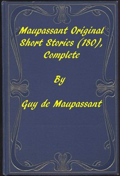

# Complete Original Short Stories of Guy De Maupassant <kbd>3090</kbd>

## Authors

 - Maupassant, Guy de <small>(1850 - 1893)</small>

## Subjects

 - French fiction -- Translations into English
 - Short stories, French -- Translations into English

## Download

 - https://www.gutenberg.org/files/3090/3090-h/3090-h.htm
 - https://www.gutenberg.org/cache/epub/3090/pg3090.cover.medium.jpg
 - https://www.gutenberg.org/files/3090/3090-0.zip
 - https://www.gutenberg.org/ebooks/3090.html.images
 - https://www.gutenberg.org/files/3090/3090-0.txt
 - https://www.gutenberg.org/ebooks/3090.rdf
 - https://www.gutenberg.org/ebooks/3090.epub.images
 - https://www.gutenberg.org/ebooks/3090.kindle.images

## Book Shelves

