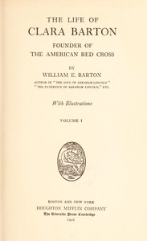

# The Life of Clara Barton, Founder of the American Red Cross (Vol. 1 of 2) <kbd>67505</kbd>

## Authors

 - Barton, William E. (William Eleazar) <small>(1861 - 1930)</small>

## Subjects

 - American National Red Cross -- Biography
 - Barton, Clara, 1821-1912
 - Nurses -- United States -- Biography

## Download

 - https://www.gutenberg.org/cache/epub/67505/pg67505.cover.medium.jpg
 - https://www.gutenberg.org/files/67505/67505-h.zip
 - https://www.gutenberg.org/ebooks/67505.txt.utf-8
 - https://www.gutenberg.org/ebooks/67505.rdf
 - https://www.gutenberg.org/ebooks/67505.epub.images
 - https://www.gutenberg.org/ebooks/67505.kindle.images
 - https://www.gutenberg.org/files/67505/67505-0.txt
 - https://www.gutenberg.org/files/67505/67505-h/67505-h.htm

## Book Shelves

